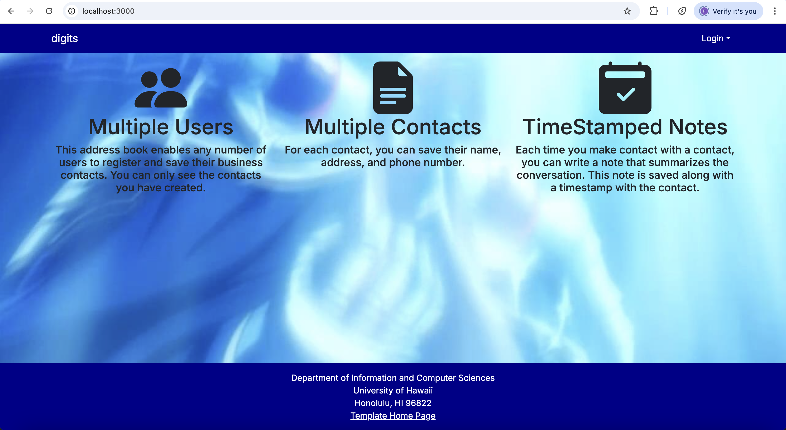
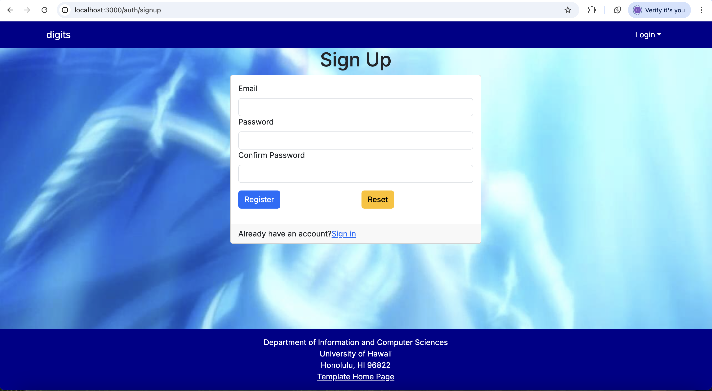
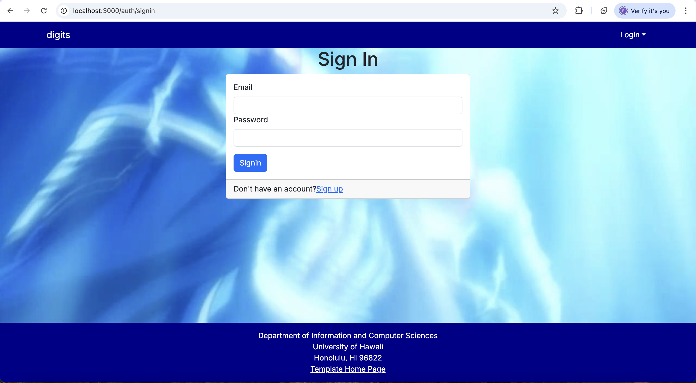
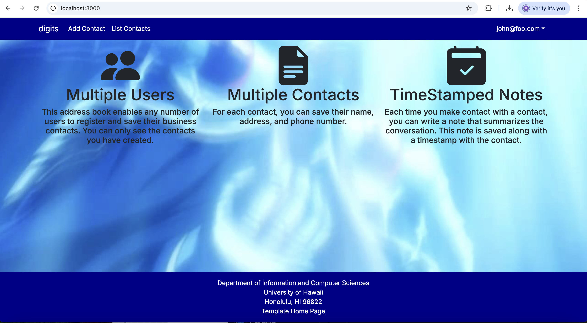
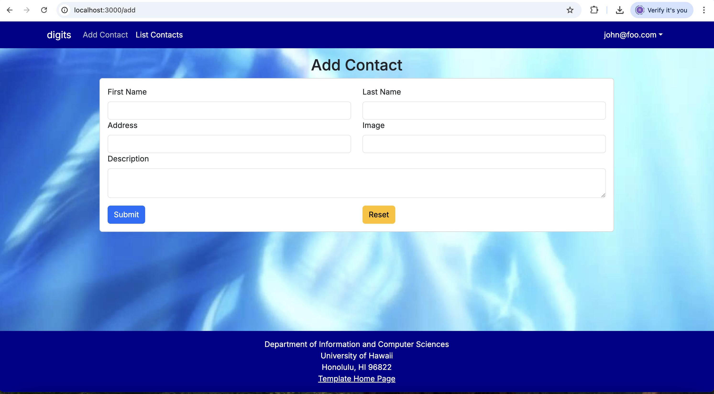
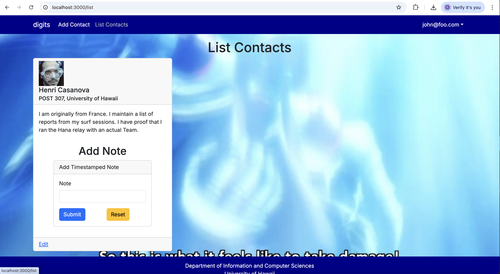
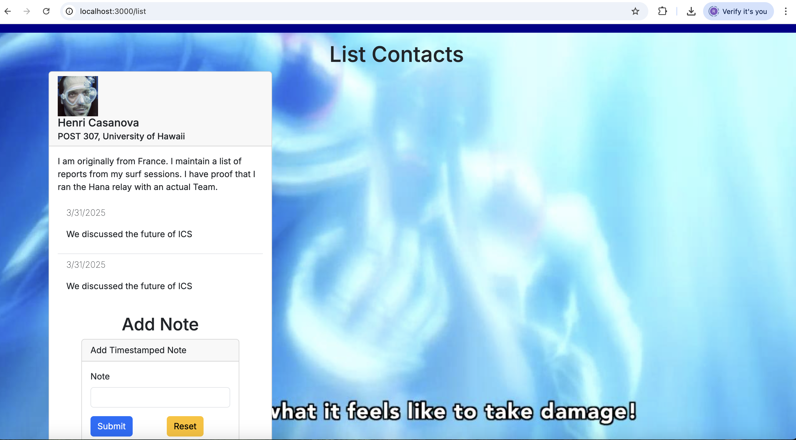
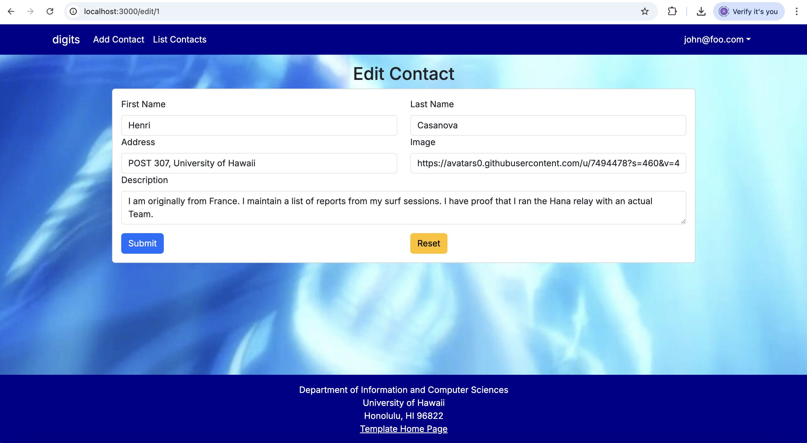
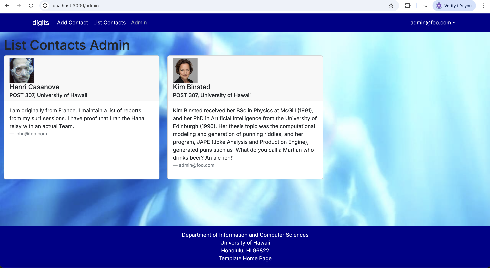

Digits is an application that allows users to:

- Register an account.
- Create and manage a set of contacts. 
- Add a set of timestamped notes regarding their interactions with each contact.

## Installation

First, [install PostgreSQL](https://www.postgresql.org/download/). Then create a database for your application.

```

$ createdb nextjs-application-template
Password:
$

```

Second, go to [https://github.com/ics-software-engineering/nextjs-application-template](https://github.com/ics-software-engineering/nextjs-application-template), and click the "Use this template" button. Complete the dialog box to create a new repository that you own that is initialized with this template's files.

Third, go to your newly created repository, and click the "Clone or download" button to download your new GitHub repo to your local file system. Using [GitHub Desktop](https://desktop.github.com/) is a great choice if you use MacOS or Windows.

Fourth, cd into the directory of your local copy of the repo, and install third party libraries with:

```

$ npm install

```

Fifth, create a `.env` file from the `sample.env`. Set the `DATABASE_URL` variable to match your PostgreSQL database that you created in the first step. See the Prisma docs [Connect your database](https://www.prisma.io/docs/getting-started/setup-prisma/add-to-existing-project/relational-databases/connect-your-database-typescript-postgresql). Then run the Prisma migration `npx prisma migrate dev` to set up the PostgreSQL tables.

```

$ npx prisma migrate dev
Environment variables loaded from .env
Prisma schema loaded from prisma/schema.prisma
Datasource "db": PostgreSQL database "<your database name>", schema "public" at "localhost:5432"

Applying migration `20240708195109_init`

The following migration(s) have been applied:

migrations/
└─ 20240708195109_init/
└─ migration.sql

Your database is now in sync with your schema.

✔ Generated Prisma Client (v5.16.1) to ./node_modules/@prisma/client in 51ms

$

```

Then seed the database with the `/config/settings.development.json` data using `npx prisma db seed`.

```

$ npx prisma db seed
Environment variables loaded from .env
Running seed command `ts-node --compiler-options {"module":"CommonJS"} prisma/seed.ts` ...
Seeding the database
Creating user: admin@foo.com with role: ADMIN
Creating user: john@foo.com with role: USER
Adding stuff: Basket (john@foo.com)
Adding stuff: Bicycle (john@foo.com)
Adding stuff: Banana (admin@foo.com)
Adding stuff: Boogie Board (admin@foo.com)

🌱 The seed command has been executed.
$

```

## Running the system

Once the libraries are installed and the database seeded, you can run the application by invoking the "dev" script in the [package.json file](https://github.com/ics-software-engineering/nextjs-application-template/blob/master/app/package.json):

```

$ npm run dev

> nextjs-application-template-1@0.1.0 dev
> next dev

▲ Next.js 14.2.4

- Local: http://localhost:3000
- Environments: .env

✓ Starting...
✓ Ready in 1619ms

```

### Viewing the running app

If all goes well, the template application will appear at [http://localhost:3000](http://localhost:3000). You can login using the credentials in [settings.development.json](https://github.com/ics-software-engineering/nextjs-application-template/blob/main/config/settings.development.json), or else register a new account.

### ESLint

You can verify that the code obeys our coding standards by running ESLint over the code in the src/ directory with:

```
$ npm run lint

> nextjs-application-template-1@0.1.0 lint
> next lint

✔ No ESLint warnings or errors
$
```

# User Interface Walkthrough

## Landing page
When you first bring up the application, you will see the landing page that provides a brief introduction to the capabilities of Digits:


## Register page

If you do not yet have an account on the system, you can register by clicking on “Login”, then “Sign Up”:



## Sign in page

Click on the Login link, then click on the Signin link to bring up the Sign In page which allows you to login:




## User home page

After successfully logging in, the system takes you to your home page. It is just like the landing page, but the NavBar contains links to list contact and add new contacts: 



## Add Contact page

After logging in, here is the page that allows you to add new Contact:



## List Contacts page

Clicking on the List Contacts link brings up a page that lists all of the contacts associated with the logged in user:



This page also allows the user to add timestamped “notes” detailing interactions they’ve had with the Contact. For example:



## Edit Contacts

From the List Contacts page, the user can click the “Edit” link associated with any Contact to bring up a page that allows that Contact information to be edited:



## Admin page

It is possible to designate one or more users as “Admins” through the settings file. When a user has the Admin role, they get access to a special NavBar link that retrieves a page listing all Contacts associated with all users:




<!--
## Screencasts

For more information about this system, please watch one or more of the following screencasts. Note that the current source code might differ slightly from the code in these screencasts, but the changes should be very minor.

- [Walkthrough of system user interface (6 min)](https://youtu.be/48xu1hrqUi8)
- [Data and accounts structure and initialization (18 min)](https://youtu.be/HZRjwrVBWp4)
- [Navigation, routing, pages, components (34 min)](https://youtu.be/XztTdHpv6Jw)
- [Forms (32 min)](https://youtu.be/8FyWR3gUGCM)
- [Authorization, authentication, and roles (12 min)](https://youtu.be/9HX5vuXTlvA)
-->
